# Primers and probes calibration vignette

## Summary: calibrating primer sets from a real experimental test

This vignette shows how to use tidyqpcr functions to calibrate qPCR
probes.

This is real qPCR data by Edward Wallace in Feb 2019, testing new
RT-qPCR primer sets against *S. cerevisiae* genes. We took
exponential-phase total RNA previously extracted by Jamie Auxillos.

We tested 2-3 primer sets each for 7 genes:

- ECM38/YLR299W (3 primer sets)
- FET5/YFL041W (3 primer sets)
- GPT2/YKR067W
- ILV5/YLR355C
- NRD1/YNL251C
- RDL1/YOR285W
- TFS1/YLR178C

We started with two biological replicate RNA samples, treated with DNase
and then split for a test sample with reverse transcriptase (RT) and
negative control without reverse transcriptase (-RT). We also took a no
template (NT) negative control. For each RT reaction we do serial 5x
dilutions down to 125x to form a quantitative calibration curve.

The data were measured on a Roche LC480 instrument in a single 384-well
plate. Quantification was performed in the Roche LightCycler software
prior to exporting the data.

### Setup knitr options and load packages

``` r

# knitr options for report generation
knitr::opts_chunk$set(
  warning = FALSE, message = FALSE, echo = TRUE, cache = FALSE,
  results = "show"
)

# Load packages
library(tidyr)
library(ggplot2)
library(dplyr)
library(tidyqpcr)

# set default theme for graphics
theme_set(theme_bw(base_size = 11) %+replace%
  theme(
    strip.background = element_blank(),
    panel.grid = element_blank()
  ))
```

## Set up experiment

### Describe which primer set we put in which well using a row key

In this experiment, each primer set was in a different row of the
384-well plate. We describe this by creating a row key, a data frame
describing the rows of the plate, the primer sets, and the genes that
they detect.

We refer to each primer set as a `target_id`, because each primer set
has a different target amplicon, on a different location in a gene.
tidyqpcr insists on having a variable called `target_id` that uniquely
identifies each different target that you detect.

``` r

# Names of target genes
gene_name_levels <- c("ECM38", "FET5", "GPT2", "ILV5", "NRD1", "RDL1", "TFS1")
# ORF ids of target genes
target_levels <- c("YLR299W", "YFL041W", "YKR067W", "YLR355C",
                   "YNL251C", "YOR285W", "YLR178C")
# Repeats of gene names to account for testing multiple primer sets
gene_name_values <- c(rep(gene_name_levels[1:2], each = 3),
                      rep(gene_name_levels[3:7], each = 2))
# id numbers of multiple probesets (reflecting IDs as ordered)
target_id_levels <- paste(gene_name_values,
  c(1, 2, 3, 1, 3, 4, 1, 4, 1, 4, 1, 2, 4, 5, 1, 5),
  sep = "_"
)


rowkey <- tibble(
  well_row = LETTERS[1:16],
  gene_name = factor(gene_name_values, levels = gene_name_levels),
  target_id = factor(target_id_levels, levels = target_id_levels)
)
print(rowkey)
```

    ## # A tibble: 16 × 3
    ##    well_row gene_name target_id
    ##    <chr>    <fct>     <fct>    
    ##  1 A        ECM38     ECM38_1  
    ##  2 B        ECM38     ECM38_2  
    ##  3 C        ECM38     ECM38_3  
    ##  4 D        FET5      FET5_1   
    ##  5 E        FET5      FET5_3   
    ##  6 F        FET5      FET5_4   
    ##  7 G        GPT2      GPT2_1   
    ##  8 H        GPT2      GPT2_4   
    ##  9 I        ILV5      ILV5_1   
    ## 10 J        ILV5      ILV5_4   
    ## 11 K        NRD1      NRD1_1   
    ## 12 L        NRD1      NRD1_2   
    ## 13 M        RDL1      RDL1_4   
    ## 14 N        RDL1      RDL1_5   
    ## 15 O        TFS1      TFS1_1   
    ## 16 P        TFS1      TFS1_5

### Combine the row key describing primer sets with column key describing on samples and dilutions.

We use a default design built in to tidyqpcr,
`create_colkey_4diln_2ctrl_in_24`.

``` r

plate1plan <-
  label_plate_rowcol(
    create_blank_plate(),
    rowkey,
    create_colkey_4diln_2ctrl_in_24()
  ) %>%
  mutate(sample_id = paste(biol_rep, dilution_nice, sep = "_"))
```

### Spot-check the plate plan

Checks that for selected technical replicate/probe/dilution
combinations, the plate contains the right number of replicates.

``` r

plate1plan %>%
  filter(tech_rep == "1",
         target_id == target_id_levels[1],
         dilution_nice == "1x")
```

    ## # A tibble: 2 × 11
    ##   well  well_row well_col dilution dilution_nice prep_type biol_rep tech_rep
    ##   <chr> <fct>    <fct>       <dbl> <chr>         <fct>     <fct>    <fct>   
    ## 1 A1    A        1               1 1x            +RT       A        1       
    ## 2 A13   A        13              1 1x            +RT       B        1       
    ## # ℹ 3 more variables: gene_name <fct>, target_id <fct>, sample_id <chr>

``` r

plate1plan %>%
  filter(tech_rep == "2",
         target_id == target_id_levels[4])
```

    ## # A tibble: 12 × 11
    ##    well  well_row well_col dilution dilution_nice prep_type biol_rep tech_rep
    ##    <chr> <fct>    <fct>       <dbl> <chr>         <fct>     <fct>    <fct>   
    ##  1 D7    D        7           1     1x            +RT       A        2       
    ##  2 D8    D        8           0.2   5x            +RT       A        2       
    ##  3 D9    D        9           0.04  25x           +RT       A        2       
    ##  4 D10   D        10          0.008 125x          +RT       A        2       
    ##  5 D11   D        11          1     -RT           -RT       A        2       
    ##  6 D12   D        12          1     NT            NT        A        2       
    ##  7 D19   D        19          1     1x            +RT       B        2       
    ##  8 D20   D        20          0.2   5x            +RT       B        2       
    ##  9 D21   D        21          0.04  25x           +RT       B        2       
    ## 10 D22   D        22          0.008 125x          +RT       B        2       
    ## 11 D23   D        23          1     -RT           -RT       B        2       
    ## 12 D24   D        24          1     NT            NT        B        2       
    ## # ℹ 3 more variables: gene_name <fct>, target_id <fct>, sample_id <chr>

### Display the plate plan

This can be printed out to facilitate loading the plate correctly.

``` r

display_plate_qpcr(plate1plan)
```

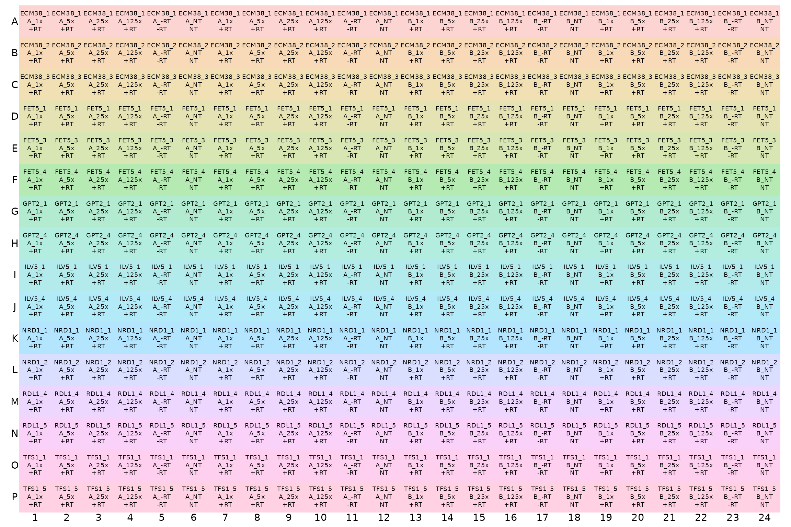

## Analyse Cq (quantification cycle count) data

### Load and summarize data

``` r

# NOTE: system.file() accesses data from this R package
# To use your own data, remove the call to system.file(),
# instead pass your data's filename to read_lightcycler_1colour_cq()
# or to another relevant read_ function
file_path_cq <- system.file("extdata",
              "Edward_qPCR_Nrd1_calibration_2019-02-02_Cq.txt.gz",
              package = "tidyqpcr")

plates <- 
  file_path_cq %>%
  read_lightcycler_1colour_cq() %>%
  right_join(plate1plan, by = "well")
```

``` r

plates
```

    ## # A tibble: 384 × 18
    ##    include color well  sample_info    cq concentration standard status well_row
    ##    <lgl>   <int> <chr> <chr>       <dbl>         <dbl>    <int> <lgl>  <fct>   
    ##  1 TRUE      255 A1    Sample 1     22.8            NA        0 NA     A       
    ##  2 TRUE      255 A2    Sample 2     24.7            NA        0 NA     A       
    ##  3 TRUE      255 A3    Sample 3     26.8            NA        0 NA     A       
    ##  4 TRUE      255 A4    Sample 4     28.6            NA        0 NA     A       
    ##  5 TRUE    65280 A5    Sample 5     NA              NA        0 NA     A       
    ##  6 TRUE    65280 A6    Sample 6     NA              NA        0 NA     A       
    ##  7 TRUE      255 A7    Sample 7     23.2            NA        0 NA     A       
    ##  8 TRUE      255 A8    Sample 8     24.8            NA        0 NA     A       
    ##  9 TRUE      255 A9    Sample 9     26.9            NA        0 NA     A       
    ## 10 TRUE    65280 A10   Sample 10    NA              NA        0 NA     A       
    ## # ℹ 374 more rows
    ## # ℹ 9 more variables: well_col <fct>, dilution <dbl>, dilution_nice <chr>,
    ## #   prep_type <fct>, biol_rep <fct>, tech_rep <fct>, gene_name <fct>,
    ## #   target_id <fct>, sample_id <chr>

``` r

summary(plates)
```

    ##  include            color              well        sample_info        cq       
    ##  Mode:logical   Min.   :  255   Length   :384   Length   :384   Min.   :13.89  
    ##  TRUE:384       1st Qu.:  255   N.unique :384   N.unique :384   1st Qu.:20.55  
    ##                 Median :  255   N.blank  :  0   N.blank  :  0   Median :23.44  
    ##                 Mean   :18035   Min.nchar:  2   Min.nchar:  8   Mean   :23.63  
    ##                 3rd Qu.:65280   Max.nchar:  3   Max.nchar: 10   3rd Qu.:26.68  
    ##                 Max.   :65280                                   Max.   :36.77  
    ##                                                                 NAs    :105    
    ##  concentration    standard  status           well_row      well_col  
    ##  Min.   : NA   Min.   :0   Mode:logical   A      : 24   1      : 16  
    ##  1st Qu.: NA   1st Qu.:0   NAs :384       B      : 24   2      : 16  
    ##  Median : NA   Median :0                  C      : 24   3      : 16  
    ##  Mean   :NaN   Mean   :0                  D      : 24   4      : 16  
    ##  3rd Qu.: NA   3rd Qu.:0                  E      : 24   5      : 16  
    ##  Max.   : NA   Max.   :0                  F      : 24   6      : 16  
    ##  NAs    :384                              (Other):240   (Other):288  
    ##     dilution        dilution_nice prep_type biol_rep tech_rep gene_name 
    ##  Min.   :0.0080   Length   :384   +RT:256   A:192    1:192    ECM38:72  
    ##  1st Qu.:0.0400   N.unique :  6   -RT: 64   B:192    2:192    FET5 :72  
    ##  Median :0.6000   N.blank  :  0   NT : 64                     GPT2 :48  
    ##  Mean   :0.5413   Min.nchar:  2                               ILV5 :48  
    ##  3rd Qu.:1.0000   Max.nchar:  4                               NRD1 :48  
    ##  Max.   :1.0000                                               RDL1 :48  
    ##                                                               TFS1 :48  
    ##    target_id       sample_id  
    ##  ECM38_1: 24   Length   :384  
    ##  ECM38_2: 24   N.unique : 12  
    ##  ECM38_3: 24   N.blank  :  0  
    ##  FET5_1 : 24   Min.nchar:  4  
    ##  FET5_3 : 24   Max.nchar:  6  
    ##  FET5_4 : 24                  
    ##  (Other):240

### Visualise Cq values for each well.

Visualising the Cq values shows that the Cq value is different for each
primer set in each row. Within each section of a row for a single
replicate of dilutions, Cq consistently increases with dilutions as
expected. The grey tiles for most -RT and NT columns mean that the value
is `NA`, i.e. no Cq value was reported. This is good.

``` r

display_plate_value(plates)
```

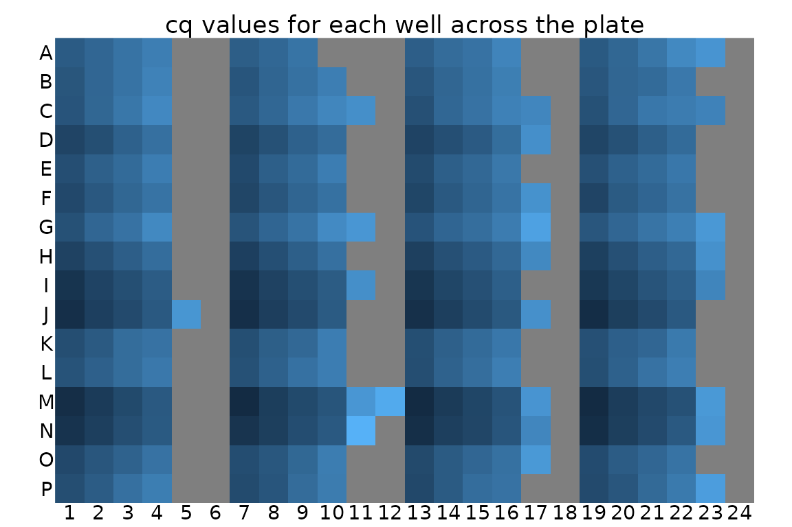

Visualisation might also help to identify unwanted positional effects.
For example, a PCR machine is broken, wells close to an edge of the
plate can have different behaviour from central wells.

### Plot unnormalized data shows that -RT and NT controls are low

This plot visualises the Cq data in a way that highlights the meaning
instead of the position on the plate. Again, it shows that the Cq value
is different for each primer set, and that for each primer st Cq
consistently increases with dilutions as expected.

Again, we detect no signal in NT (no template) negative control so those
points are mostly missing. There is a very weak signal with high Cq in
some -RT (no reverse transcriptase) negative controls.

``` r

ggplot(data = plates) +
  geom_point(aes(x = target_id,
                 y = cq,
                 colour = dilution_nice,
                 shape = prep_type),
    position = position_jitter(width = 0.2, height = 0)
  ) +
  labs(
    y = "Cycle count to threshold",
    title = "All reps, unnormalized"
  ) +
  facet_wrap(~biol_rep) +
  scale_y_continuous(breaks = seq(from = 15, to = 35, by = 5)) + 
  theme(axis.text.x = element_text(angle = 90, vjust = 0.5),
        panel.grid.major.y = element_line(colour="grey80", size = 0.2))
```

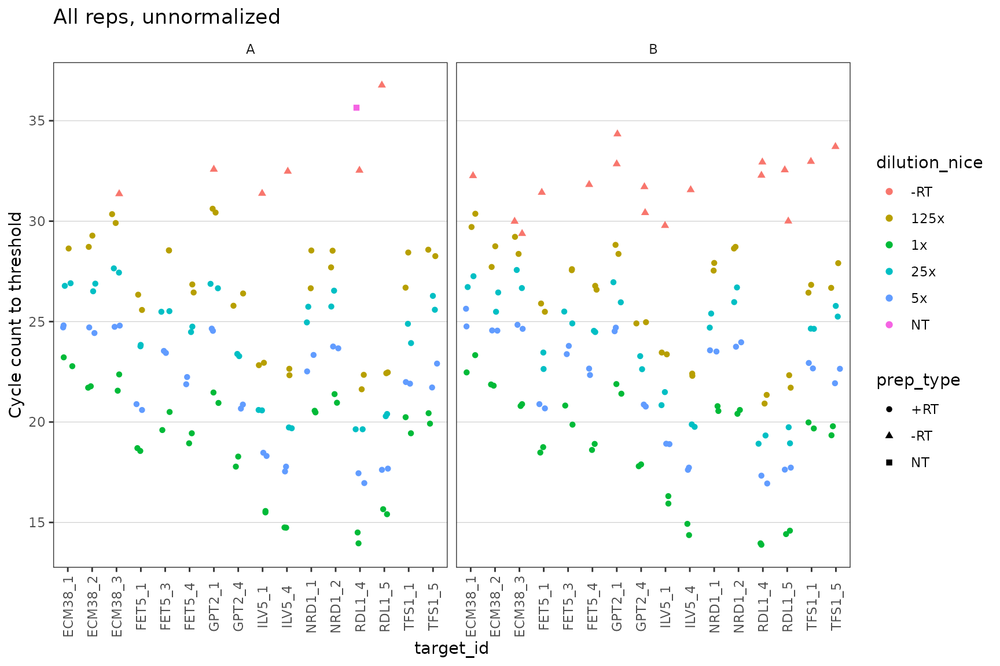

### Dilution series is linear for all probes

Visual display of linearity of cq with log(dilution).

``` r

ggplot(data = filter(plates, prep_type == "+RT"), aes(x = dilution, y = cq)) +
  geom_point() +
  stat_smooth(
    formula = y ~ x, method = "lm", se = FALSE,
    aes(colour = "fit", linetype = "fit")
  ) +
  stat_smooth(
    formula = y ~ 1 + offset(-x * log(10) / log(2)), method = "lm", se = FALSE,
    aes(colour = "theory", linetype = "theory")
  ) +
  scale_x_log10(breaks = 10 ^ - (0:3)) +
  scale_y_continuous(breaks = seq(0, 30, 2)) +
  labs(
    y = "Cycle count to threshold",
    title = "All reps, unnormalized",
    colour = "Dilution", linetype = "Dilution"
  ) +
  facet_grid(target_id ~ biol_rep, scales = "free_y") +
  theme(axis.text.x = element_text(angle = 90, vjust = 0.5))
```

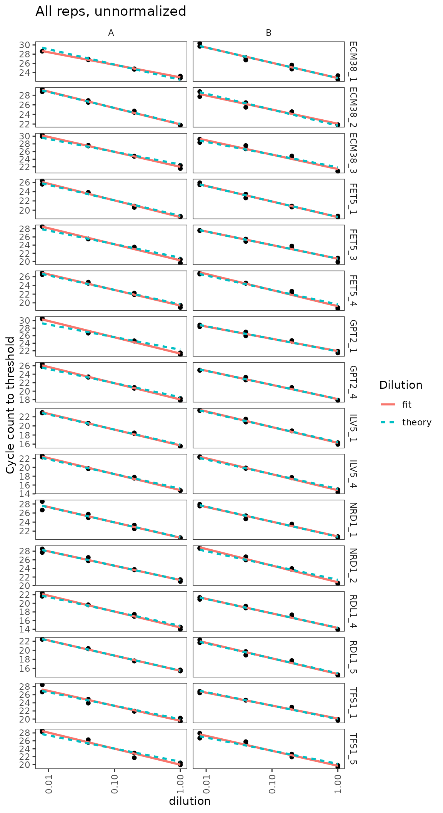

### Calculate primer efficiencies for all probes

Use regression to estimate linearity of cq with log(dilution), including
the slope or efficiency.

``` r

calculate_efficiency_bytargetid(plates)
```

    ## # A tibble: 16 × 4
    ##    target_id efficiency efficiency.sd r.squared
    ##    <fct>          <dbl>         <dbl>     <dbl>
    ##  1 ECM38_1        0.923        0.0480     0.970
    ##  2 ECM38_2        0.958        0.0429     0.975
    ##  3 ECM38_3        1.15         0.0524     0.974
    ##  4 FET5_1         1.05         0.0317     0.988
    ##  5 FET5_3         1.09         0.0507     0.973
    ##  6 FET5_4         1.09         0.0413     0.982
    ##  7 GPT2_1         1.14         0.0601     0.965
    ##  8 GPT2_4         1.08         0.0345     0.987
    ##  9 ILV5_1         1.04         0.0222     0.994
    ## 10 ILV5_4         1.09         0.0239     0.994
    ## 11 NRD1_1         0.998        0.0498     0.969
    ## 12 NRD1_2         1.08         0.0423     0.981
    ## 13 RDL1_4         1.06         0.0386     0.983
    ## 14 RDL1_5         1.03         0.0327     0.987
    ## 15 TFS1_1         1.03         0.0551     0.964
    ## 16 TFS1_5         1.18         0.0544     0.973

### Dilution series for nice probes only shows linearity clearly

``` r

target_id_levels_niceprobes <- 
    c("ECM38_3", "FET5_1", "GPT2_4", "ILV5_4",
      "NRD1_1",  "RDL1_4", "TFS1_1")

ggplot(
  data = filter(plates,
                prep_type == "+RT",
                target_id %in% target_id_levels_niceprobes),
  aes(x = dilution, y = cq)
) +
  geom_point() +
  stat_smooth(
    formula = y ~ x, method = "lm", se = FALSE,
    aes(colour = "fit", linetype = "fit")
  ) +
  stat_smooth(
    formula = y ~ 1 + offset(-x * log(10) / log(2)),
    method = "lm",
    se = FALSE,
    aes(colour = "theory", linetype = "theory")
  ) +
  scale_x_log10(breaks = 10 ^ - (0:3)) +
  scale_y_continuous(breaks = seq(0, 30, 2)) +
  labs(
    y = "Cycle count to threshold",
    title = "All reps, unnormalized",
    colour = "Dilution", linetype = "Dilution"
  ) +
  facet_grid(target_id ~ biol_rep, scales = "free_y") +
  theme(axis.text.x = element_text(angle = 90, vjust = 0.5))
```

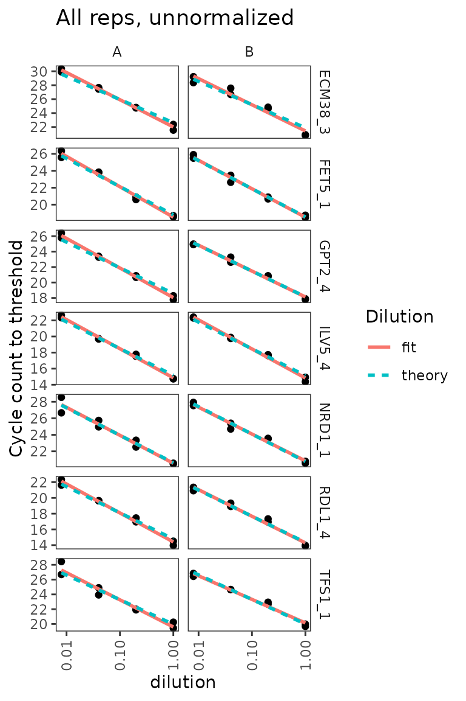

## Analyse amplification and melt curve data

### Load raw data for amplification and melt curves.

``` r

# NOTE: system.file() accesses data from this R package
# To use your own data, remove the call to system.file(),
# instead pass your data's filename to read_lightcycler_1colour_cq()
# or to another relevant read_ function

file_path_raw <- system.file("extdata/Edward_qPCR_Nrd1_calibration_2019-02-02.txt.gz",
                             package = "tidyqpcr")

plate1curve <- file_path_raw %>%
    read_lightcycler_1colour_raw() %>%
    debaseline() %>%
    left_join(plate1plan, by = "well")

# amplification curve is program 2
platesamp <- plate1curve %>%
  filter(program_no == 2)

# melt curve is program 3 or 4, depending on cycler setting
platesmelt <- plate1curve %>%
  filter(program_no == 3) %>%
  calculate_drdt_plate() %>%
  filter(temperature >= 61)
```

### Plot de-baseline’d raw data for single well

``` r

ggplot(
  data = platesamp %>% filter(well == "A1"),
  aes(x = cycle, y = fluor_signal)
) +
  geom_line() +
  scale_y_continuous(expand = c(0.01, 0.01))
```

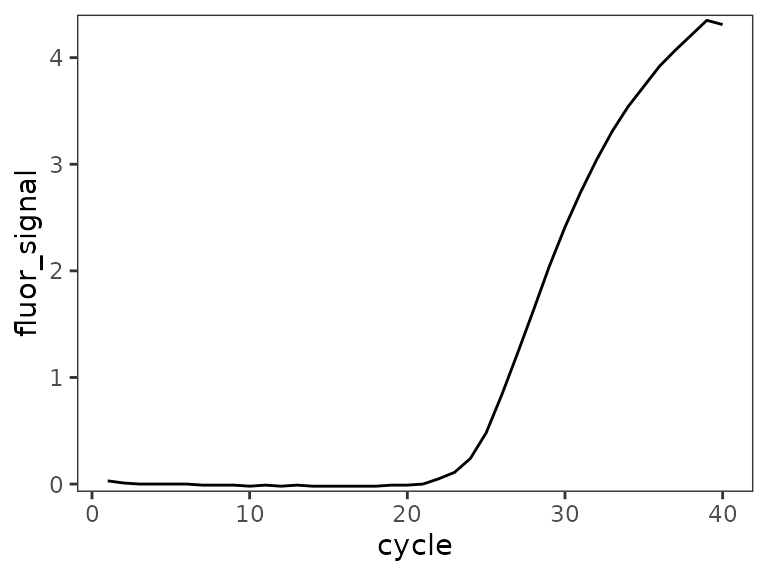

### Plot all amplification curves

Broken up by technical replicate here, to avoid overplotting.

``` r

ggplot(
  data = platesamp %>%
    filter(tech_rep == "1"),
  aes(x = cycle,
      y = fluor_signal,
      colour = factor(dilution),
      linetype = prep_type)
) +
  facet_grid(target_id ~ biol_rep, scales = "free_y") +
  scale_linetype_manual(values = c("+RT" = "solid",
                                   "-RT" = "dashed",
                                   "NT" = "dotted")) +
  geom_line() +
  scale_x_continuous(breaks = seq(60, 100, 10),
                     minor_breaks = seq(60, 100, 5)) +
  labs(title = "All Amp Curves, tech_rep A")
```

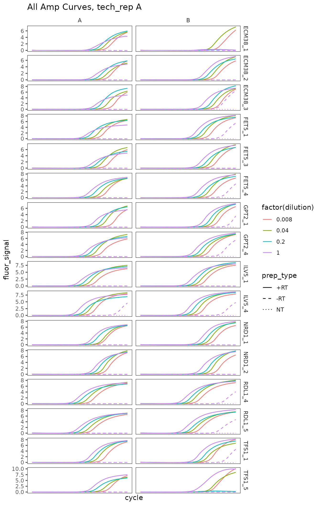

``` r

ggplot(
  data = platesamp %>%
    filter(tech_rep == "2"),
  aes(x = cycle,
      y = fluor_signal,
      colour = factor(dilution),
      linetype = prep_type)
) +
  facet_grid(target_id ~ biol_rep, scales = "free_y") +
  scale_linetype_manual(values = c("+RT" = "solid",
                                   "-RT" = "dashed",
                                   "NT" = "dotted")) +
  geom_line() +
  scale_x_continuous(breaks = seq(60, 100, 10),
                     minor_breaks = seq(60, 100, 5)) +
  labs(title = "All Amp Curves, tech_rep B")
```

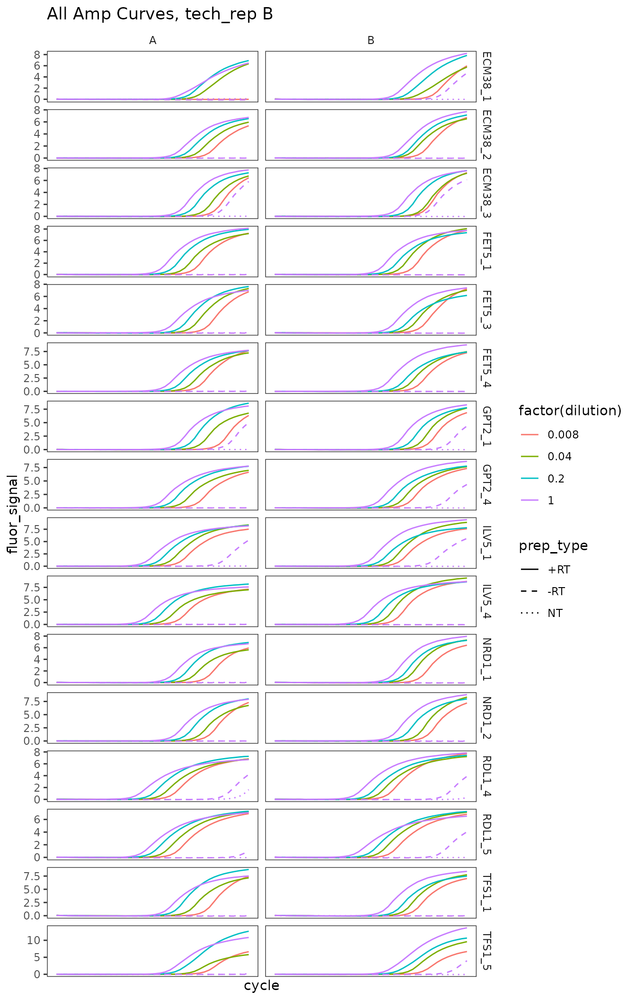

### Plot melt curve for single well

``` r

ggplot(
  data = platesmelt %>%
    filter(well == "A1"),
  aes(x = temperature, y = dRdT)
) +
  facet_wrap(~target_id) +
  geom_line() +
  scale_y_continuous(expand = c(0.02, 0.02))
```

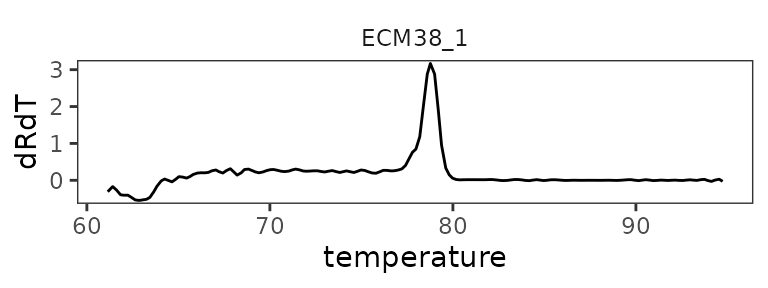

### Plot all melt curves

Again broken up by technical replicate.

``` r

ggplot(
  data = platesmelt %>%
    filter(tech_rep == "1"),
  aes(x = temperature,
      y = dRdT,
      colour = factor(dilution),
      linetype = prep_type)
) +
  facet_grid(target_id ~ biol_rep, scales = "free_y") +
  scale_linetype_manual(values = c("+RT" = "solid",
                                   "-RT" = "dashed",
                                   "NT" = "dotted")) +
  geom_line() +
  scale_x_continuous(breaks = seq(60, 100, 10),
                     minor_breaks = seq(60, 100, 5)) +
  labs(title = "All Melt Curves, tech_rep A")
```

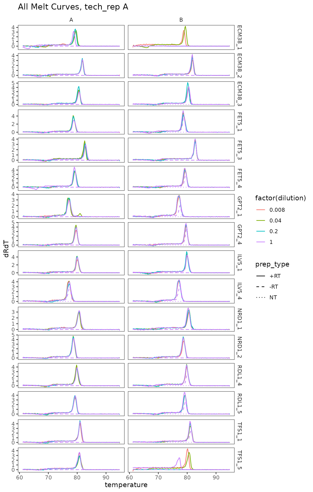

``` r

ggplot(
  data = platesmelt %>%
    filter(tech_rep == "2"),
  aes(x = temperature,
      y = dRdT,
      colour = factor(dilution),
      linetype = prep_type)
) +
  facet_grid(target_id ~ biol_rep, scales = "free_y") +
  scale_linetype_manual(values = c("+RT" = "solid",
                                   "-RT" = "dashed",
                                   "NT" = "dotted")) +
  geom_line() +
  scale_x_continuous(breaks = seq(60, 100, 10),
                     minor_breaks = seq(60, 100, 5)) +
  labs(title = "All Melt Curves, tech_rep B")
```

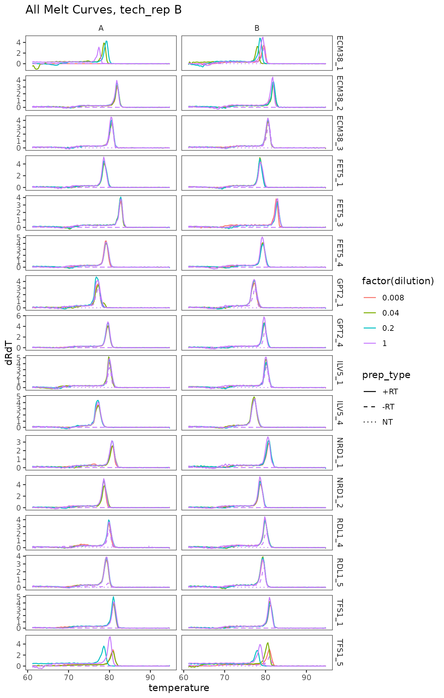

### Plot zoomed melt curves

``` r

ggplot(
  data = platesmelt %>%
    filter(tech_rep == "1", prep_type == "+RT"),
  aes(x = temperature, y = dRdT, colour = factor(dilution))
) +
  facet_grid(target_id ~ biol_rep, scales = "free_y") +
  geom_line() +
  scale_x_continuous(
    breaks = seq(60, 100, 5),
    minor_breaks = seq(60, 100, 1),
    limits = c(73, 87)
  ) +
  labs(title = "Melt curves, zoomed, tech_rep A") +
  theme(
    panel.grid.major.x = element_line(colour = "grey50", size = 0.4),
    panel.grid.minor.x = element_line(colour = "grey70", size = 0.1)
  )
```

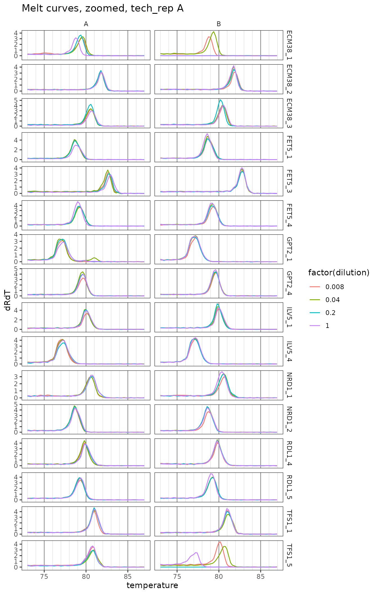

``` r

ggplot(
  data = platesmelt %>%
    filter(tech_rep == "2", prep_type == "+RT"),
  aes(x = temperature, y = dRdT, colour = factor(dilution))
) +
  facet_grid(target_id ~ biol_rep, scales = "free_y") +
  geom_line() +
  scale_x_continuous(
    breaks = seq(60, 100, 5),
    minor_breaks = seq(60, 100, 1),
    limits = c(73, 87)
  ) +
  labs(title = "Melt curves, zoomed, tech_rep B") +
  theme(
    panel.grid.major.x = element_line(colour = "grey50", size = 0.4),
    panel.grid.minor.x = element_line(colour = "grey70", size = 0.1)
  )
```

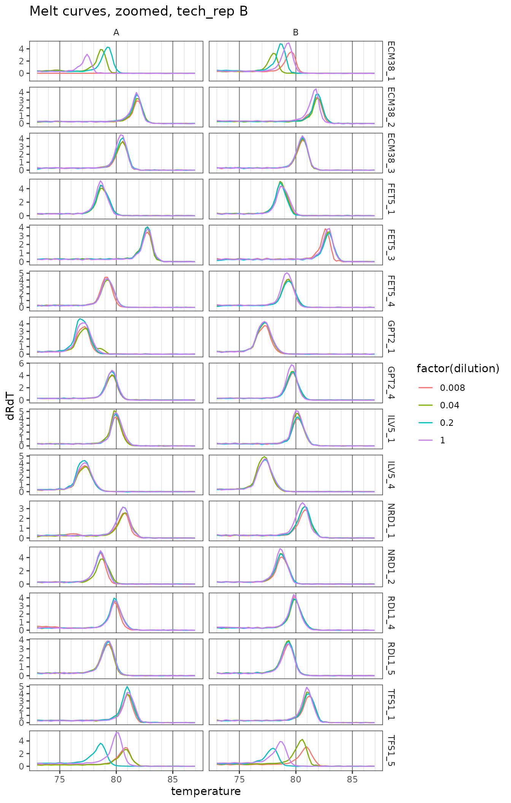

### Plot only zoomed melt curves for nice probes

``` r

ggplot(
  data = platesmelt %>%
    filter(
      tech_rep == "1",
      prep_type == "+RT",
      dilution_nice == "1x",
      target_id %in% target_id_levels_niceprobes
    ),
  aes(x = temperature, y = dRdT, colour = biol_rep)
) +
  facet_grid(target_id ~ ., scales = "free_y") +
  geom_line() +
  scale_x_continuous(
    breaks = seq(60, 100, 5),
    minor_breaks = seq(60, 100, 1),
    limits = c(73, 87)
  ) +
  labs(title = "Nice probes, tech_rep A") +
  theme(
    panel.grid.major.x = element_line(colour = "grey50", size = 0.4),
    panel.grid.minor.x = element_line(colour = "grey70", size = 0.1)
  )
```

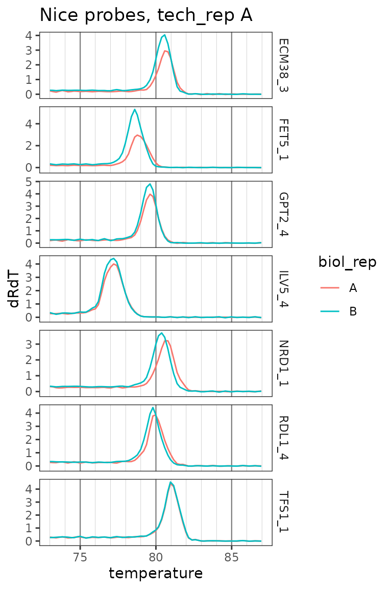

## Conclude acceptable primer sets

These probes have sensible standard curves, amplification curves, melt
curves. In tie-breakers we pick the more highly detected probe.

- ECM38 set 3
- FET5 set 1 or 4
- GPT2 set 4
- ILV5 set 4
- NRD1 set 1 or 2
- RDL1 set 4
- TFS1 set 1
