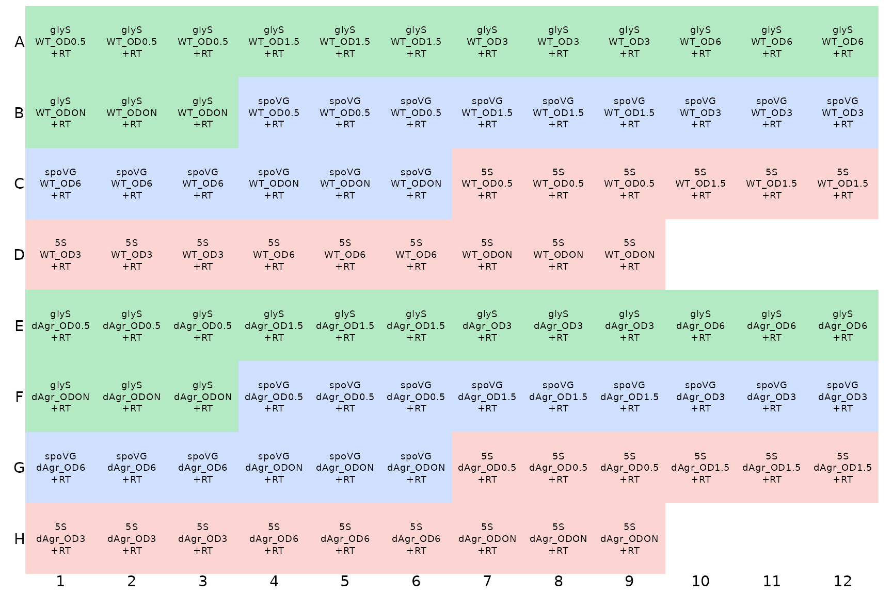
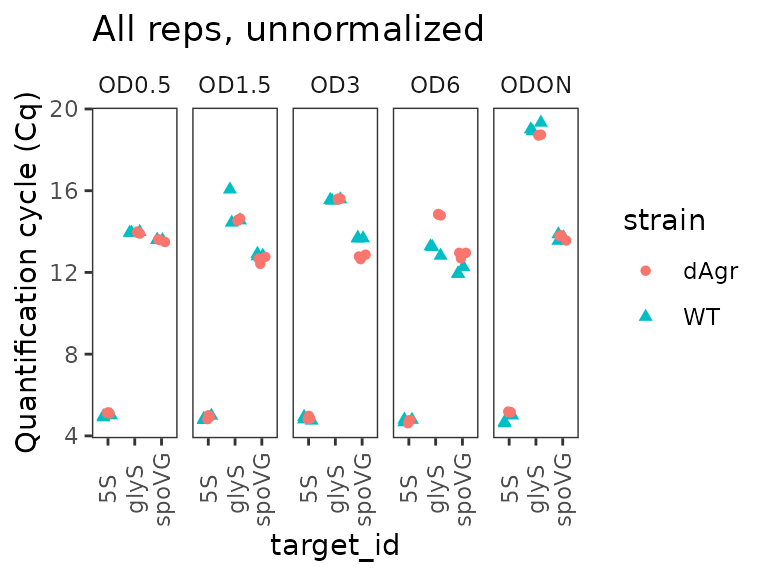
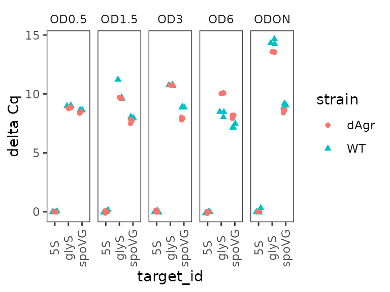
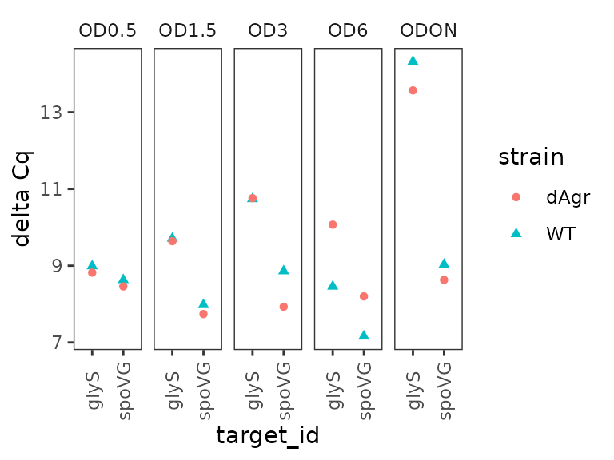
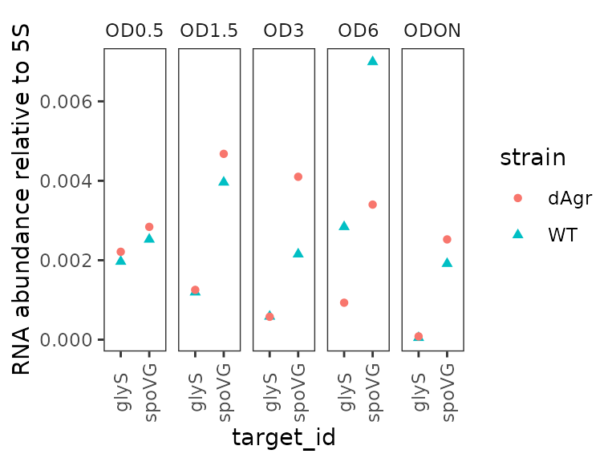
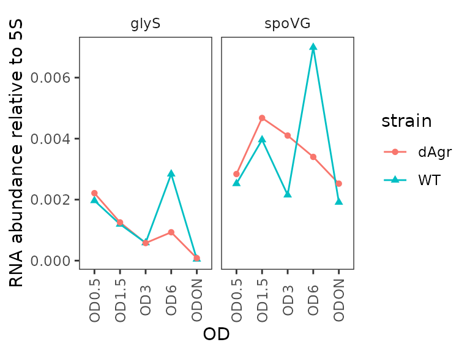
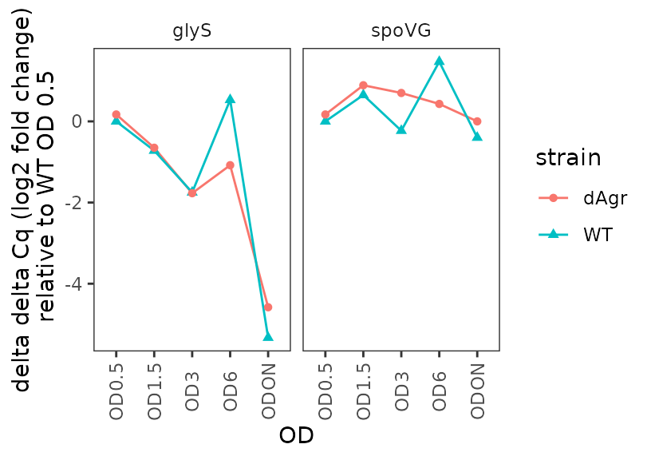
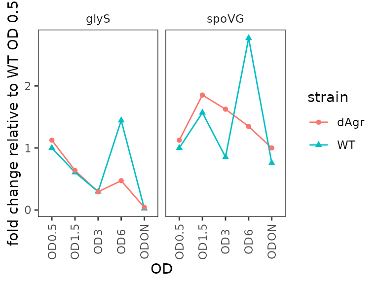

# Delta Cq 96-well plate qPCR analysis example

## Summary: an example 96-well qPCR experiment.

This vignette shows how to use tidyqpcr functions to normalize and plot
data from a single RT-qPCR experiment on a 96-well plate. We include
relative quantification, calculations of delta Cq (within-sample
normalization) and delta delta Cq (between-sample normalization), with
some example plots.

This is real RT-qPCR data by Stuart McKellar:

Aim: to measure expression of two mRNAs and one reference control in two
strains of bacteria at various growth stages (measured by OD: 0.5, 1.5,
3, 6, and overnight culture, ‘ODON’).

mRNAs: GlyS and SpoVG with 5S rRNA used as a reference control.

Bacterial strains: wild-type (WT) and mutant (dAgr).

Equipment: Data were collected on a Roche LightCycler 480, and
LightCycler software used to estimate Cq/Ct values and export that as a
text-format table. The sample information is specified in this input
data file.

### Setup knitr options and load packages

``` r

# knitr options for report generation
knitr::opts_chunk$set(
  warning = FALSE, message = FALSE, echo = TRUE, cache = FALSE,
  results = "show"
)

# Load packages
library(tidyr)
library(ggplot2)
library(dplyr)
library(readr)
library(tidyqpcr)

# set default theme for graphics
theme_set(theme_bw(base_size = 11) %+replace%
  theme(
    strip.background = element_blank(),
    panel.grid = element_blank()
  ))
```

## Loading, organizing, and sanity-checking data.

### Load data from machine output file

We start by loading data from the experiment. We print the data to
screen here, it is always a good idea to look at the data to find out if
it has loaded correctly and behaves as expected, or not.

``` r

# NOTE: system.file() accesses data from this R package
# To use your own data, remove the call to system.file(),
# instead pass your data's filename to read_tsv()
# or to another relevant read_ function

file_path_cq <- system.file("extdata",
                            "Stuart_dAgr_glyS_spoVG_5S_individualWells_Cq_select.txt.gz",
                            package = "tidyqpcr")

plate_cq_extdata <- file_path_cq %>%
  read_tsv()

plate_cq_extdata
```

    ## # A tibble: 90 × 3
    ##    well  sample_info      cq
    ##    <chr> <chr>         <dbl>
    ##  1 A1    WT OD0.5 glyS  14.0
    ##  2 A2    WT OD0.5 glyS  13.9
    ##  3 A3    WT OD0.5 glyS  14.0
    ##  4 A4    WT OD1.5 glyS  14.6
    ##  5 A5    WT OD1.5 glyS  16.1
    ##  6 A6    WT OD1.5 glyS  14.4
    ##  7 A7    WT OD3 glyS    15.6
    ##  8 A8    WT OD3 glyS    15.6
    ##  9 A9    WT OD3 glyS    15.5
    ## 10 A10   WT OD6 glyS    12.8
    ## # ℹ 80 more rows

Printing the data here shows that the `sample_info` column contains
information on the sample. We still need to organize this information
that is already associated with the data.

The [plate setup
vignette](https://docs.ropensci.org/tidyqpcr/articles/platesetup_vignette.md)
describes how to “set up” a plate plan to put sample information in, if
your input data does not already contain sample information.

Note that we “cleaned up” the data file for this vignette, to remove
irrelevant rows and columns. For information about how to load Cq data
directly from LightCycler outputs, see
[`?read_lightcycler_1colour_cq`](https://docs.ropensci.org/tidyqpcr/reference/read_lightcycler_1colour_cq.md).

### Organize sample and target data on the plate

The `sample_info` column contains values like `WT OD0.5 glyS`, where
`WT` describes the strain, `OD0.5` describes the growth stage (optical
density), and `glyS` describes the target gene that is detected. These
three pieces of information are delimited by spaces. We use the
`separate` function, from the `tidyr` package, to separate the three
pieces of information in `sample_info` into three columns, (`strain`,
`OD`, `target_id`), each of which contains a single piece of
information. Note that tidyqpcr insistently refers to the targets
detected in a qPCR experiment as `target_id`, as they could be primer
sets or hydrolysis probes targeting distinct gene regions, RNA isoforms,
SNPs, or chromosomal locations for ChIP studies. In this experiment we
have three amplicons, each from a different RNA.

However, tidyqpcr expects a column called `sample_id` that identifies
the unique sample - here, that would be identified by a strain
(e.g. `WT`) and growth stage (e.g. `OD0.5`). So we use the `unite`
function, from the `tidyr` package, to create a new column `sample_id`
that unites strain and OD. Note that key tidyqpcr variables: `sample_id`
and `target_id`, can be defined manually, as done in the [plate setup
vignette](https://docs.ropensci.org/tidyqpcr/articles/platesetup_vignette.md),
if your data does not contain a complete and correct `sample_info`
column.

Before these, we have to do a little organization. We add row and column
labels for each well, so that we can later draw the plate plan and check
the description. We use the tidyqpcr function
`create_blank_plate_96well` to make a “blank” plate plan, then join that
information to the data. The join function `inner_join` is in the
`dplyr` package.

We use the tidyverse pipe operator `%>%` to do all these transformations
in a row, with one on each line.

``` r

plate_cq_data <- 
  create_blank_plate_96well() %>% # row and column labels for each well
  inner_join(plate_cq_extdata, by = "well") %>% # join that info to loaded data
  # next separate the sample and target information for future data analysis
  separate(sample_info,
           into = c("strain","OD","target_id"), 
           sep = " ",
           remove = FALSE) %>%
  unite("sample_id",strain, OD, remove = FALSE) %>% # put sample_id together
  mutate(prep_type = "+RT") # add information on cDNA prep type

plate_cq_data
```

    ## # A tibble: 90 × 10
    ##    well  well_row well_col sample_info   sample_id strain OD    target_id    cq
    ##    <chr> <fct>    <fct>    <chr>         <chr>     <chr>  <chr> <chr>     <dbl>
    ##  1 A1    A        1        WT OD0.5 glyS WT_OD0.5  WT     OD0.5 glyS       14.0
    ##  2 A2    A        2        WT OD0.5 glyS WT_OD0.5  WT     OD0.5 glyS       13.9
    ##  3 A3    A        3        WT OD0.5 glyS WT_OD0.5  WT     OD0.5 glyS       14.0
    ##  4 A4    A        4        WT OD1.5 glyS WT_OD1.5  WT     OD1.5 glyS       14.6
    ##  5 A5    A        5        WT OD1.5 glyS WT_OD1.5  WT     OD1.5 glyS       16.1
    ##  6 A6    A        6        WT OD1.5 glyS WT_OD1.5  WT     OD1.5 glyS       14.4
    ##  7 A7    A        7        WT OD3 glyS   WT_OD3    WT     OD3   glyS       15.6
    ##  8 A8    A        8        WT OD3 glyS   WT_OD3    WT     OD3   glyS       15.6
    ##  9 A9    A        9        WT OD3 glyS   WT_OD3    WT     OD3   glyS       15.5
    ## 10 A10   A        10       WT OD6 glyS   WT_OD6    WT     OD6   glyS       12.8
    ## # ℹ 80 more rows
    ## # ℹ 1 more variable: prep_type <chr>

Again, we print the table to check that the columns and data are
correct.

### Display the plate layout

It is easier to understand pictures than tables of text. To display the
layout of samples within a microplate, tidyqpcr has a function
`display_plate_qpcr`. We use that here to show how the samples are laid
out within the plate.

``` r

display_plate_qpcr(plate_cq_data)
```



Here, the different colours indicate different `target_ids`, which is
default behaviour of `display_plate_qpcr`. This display makes it
possible to see that there are three identically-labeled wells -
technical replicates - in a row.

### Plot unnormalized Cq data

Next we plot all the data to visualise the unnormalised data points.
These visual explorations are a crucial sanity check, both on the data
itself, and also on any possible mistakes made when loading the data and
assigning labels.

Here we use functions from `ggplot` to plot the data. The interesting
output is Cq values, which go on the y axis. The data measures three
target genes in two strains in five different growth conditions. So the
first plot we make has one plot panel or facet for each growth
condition. Each facet shows values for all three targets and two
strains, with the targets on the x-axis and strains indicated by colour
and shape.

``` r

ggplot(data = plate_cq_data) +
  geom_point(aes(x = target_id, y = cq, shape = strain, colour = strain),
    position = position_jitter(width = 0.2, height = 0)
  ) +
  labs(
    y = "Quantification cycle (Cq)",
    title = "All reps, unnormalized"
  ) +
  facet_wrap(~OD,ncol=5) + 
  theme(axis.text.x = element_text(angle = 90, vjust = 0.5))
```



The plot shows that Cq values for 5S are reproducible and very low (Cq
about 5) for all samples. That makes biological sense as 5S ribosomal
rRNA is extremely abundant.

More generally, the plot shows that the technical replicates are very
close together. Technical replicates are expected to be close to each
other, so this observation visually confirms that we have labeled the
wells correctly.

## Normalized data: delta Cq

### Normalize Cq to 5S rRNA, within Sample only

Next we “normalize” by calculating delta Cq () for each target in each
sample. We treat the 5S rRNA as a reference gene, and for other mRNA
targets estimate a `delta_cq` value of the difference against the median
value for 5S rRNA within the same sample. This normalisation is
performed by the `calculate_deltacq_bysampleid` function. This function
works as follows:

- You provide the data and the name of the reference gene
  (i.e. `ref_target_ids = "5S"`)
- The function will calculate the median Cq of the reference gene
  separately for each sample
- Then the function will subtract that value from the Cq for every other
  measured gene, again separately for each sample, adding a `delta_cq`
  column to its output data
- The function also calculates relative abundance or normalized ratio to
  the reference targets, , adding a `rel_abund` column to its output
  data.

If you use *multiple* reference target ids, the function will take the
median across Cq values of *all* the reference target ids. You can also
ask the function to use a different summary, e.g. mean instead of
median. See the help file
[`?calculate_deltacq_bysampleid`](https://docs.ropensci.org/tidyqpcr/reference/calculate_deltacq_bysampleid.md)
for more details.

As ever, we print the data to screen as a sanity check.

``` r

plate_norm <- plate_cq_data %>%
  calculate_deltacq_bysampleid(ref_target_ids = "5S")

plate_norm
```

    ## # A tibble: 90 × 13
    ##    well  well_row well_col sample_info    sample_id strain OD    target_id    cq
    ##    <chr> <fct>    <fct>    <chr>          <chr>     <chr>  <chr> <chr>     <dbl>
    ##  1 A1    A        1        WT OD0.5 glyS  WT_OD0.5  WT     OD0.5 glyS      14.0 
    ##  2 A2    A        2        WT OD0.5 glyS  WT_OD0.5  WT     OD0.5 glyS      13.9 
    ##  3 A3    A        3        WT OD0.5 glyS  WT_OD0.5  WT     OD0.5 glyS      14.0 
    ##  4 B4    B        4        WT OD0.5 spoVG WT_OD0.5  WT     OD0.5 spoVG     13.6 
    ##  5 B5    B        5        WT OD0.5 spoVG WT_OD0.5  WT     OD0.5 spoVG     13.6 
    ##  6 B6    B        6        WT OD0.5 spoVG WT_OD0.5  WT     OD0.5 spoVG     13.6 
    ##  7 C7    C        7        WT OD0.5 5S    WT_OD0.5  WT     OD0.5 5S         4.91
    ##  8 C8    C        8        WT OD0.5 5S    WT_OD0.5  WT     OD0.5 5S         4.96
    ##  9 C9    C        9        WT OD0.5 5S    WT_OD0.5  WT     OD0.5 5S         5.01
    ## 10 A4    A        4        WT OD1.5 glyS  WT_OD1.5  WT     OD1.5 glyS      14.6 
    ## # ℹ 80 more rows
    ## # ℹ 4 more variables: prep_type <chr>, ref_cq <dbl>, delta_cq <dbl>,
    ## #   rel_abund <dbl>

### Plot normalized data, all reps

Similar to above, we plot all the replicates of the normalised data.

``` r

ggplot(data = plate_norm) +
  geom_point(aes(x = target_id, y = delta_cq, shape = strain, colour = strain),
    position = position_jitter(width = 0.2, height = 0)
  ) +
  labs(y = "delta Cq") +
  facet_wrap(~OD,ncol=5) + 
  theme(axis.text.x = element_text(angle = 90, vjust = 0.5))
```



This looks quite similar to the unnormalized data plot, except as
expected the reference gene samples are all now deltaCq = 0, and there
are small movements in the other points reflecting the normalization
process.

### Calculate a summary value for each sample-target combination

Having made normalized values, we use `group_by` and `summarize` from
the `dplyr` package to calculate the median values of `delta_cq` and
`rel_abund` for each sample. This makes a smaller table by collapsing 3
technical replicates into a single summary value for each
`sample_id`-`target_id` combination.

``` r

plate_med <- plate_norm %>%
  group_by(sample_id, strain, OD, target_id) %>%
  summarize(
    delta_cq  = median(delta_cq, na.rm = TRUE),
    rel_abund = median(rel_abund, na.rm = TRUE)
  )

plate_med
```

    ## # A tibble: 30 × 6
    ## # Groups:   sample_id, strain, OD [10]
    ##    sample_id strain OD    target_id delta_cq rel_abund
    ##    <chr>     <chr>  <chr> <chr>        <dbl>     <dbl>
    ##  1 WT_OD0.5  WT     OD0.5 5S            0     1       
    ##  2 WT_OD0.5  WT     OD0.5 glyS          8.99  0.00197 
    ##  3 WT_OD0.5  WT     OD0.5 spoVG         8.63  0.00252 
    ##  4 WT_OD1.5  WT     OD1.5 5S            0     1       
    ##  5 WT_OD1.5  WT     OD1.5 glyS          9.71  0.00119 
    ##  6 WT_OD1.5  WT     OD1.5 spoVG         7.98  0.00396 
    ##  7 WT_OD3    WT     OD3   5S            0     1       
    ##  8 WT_OD3    WT     OD3   glyS         10.7   0.000585
    ##  9 WT_OD3    WT     OD3   spoVG         8.86  0.00215 
    ## 10 WT_OD6    WT     OD6   5S            0     1       
    ## # ℹ 20 more rows

It can be easier to focus on a smaller subset of the data. Here we print
just the data for a single target, `glyS`:

``` r

filter(plate_med, target_id == "glyS")
```

    ## # A tibble: 10 × 6
    ## # Groups:   sample_id, strain, OD [10]
    ##    sample_id  strain OD    target_id delta_cq rel_abund
    ##    <chr>      <chr>  <chr> <chr>        <dbl>     <dbl>
    ##  1 WT_OD0.5   WT     OD0.5 glyS          8.99 0.00197  
    ##  2 WT_OD1.5   WT     OD1.5 glyS          9.71 0.00119  
    ##  3 WT_OD3     WT     OD3   glyS         10.7  0.000585 
    ##  4 WT_OD6     WT     OD6   glyS          8.46 0.00284  
    ##  5 WT_ODON    WT     ODON  glyS         14.3  0.0000489
    ##  6 dAgr_OD0.5 dAgr   OD0.5 glyS          8.82 0.00221  
    ##  7 dAgr_OD1.5 dAgr   OD1.5 glyS          9.64 0.00125  
    ##  8 dAgr_OD3   dAgr   OD3   glyS         10.8  0.000577 
    ##  9 dAgr_OD6   dAgr   OD6   glyS         10.1  0.000930 
    ## 10 dAgr_ODON  dAgr   ODON  glyS         13.6  0.0000822

This table confirms that `glyS` summary Cq values are similar for both
strains at a given OD value, and higher at `ODON`.

### Plot delta Cq for each OD separately across genes

Here we plot the summarized delta Cq, which now has a single point for
each `sample_id`-`target_id` combination (representing the summary of
the three technical replicates). As above, we plot OD on a separate
facet panel to emphasizes comparisons between target genes at the same
OD. We exclude the reference target gene, 5S, because for that delta Cq
is always zero.

``` r

ggplot(data = filter(plate_med, target_id != "5S") ) + 
  geom_point(aes(x = target_id, y = delta_cq, shape = strain, colour = strain) ) + 
  labs(
    y = "delta Cq"
  ) +
  facet_wrap(~OD,ncol=5) + 
  theme(axis.text.x = element_text(angle = 90, vjust = 0.5))
```



### Plot relative abundance for each OD separately across genes

The `calculate_deltacq_bysampleid` function also reports abundance
relative to reference target, 5S rRNA. Precisely, this is . Now we plot
the relative abundance, again with each OD on a separate facet panel,
which emphasizes comparisons between target genes at the same OD.

``` r

ggplot(data = filter(plate_med, target_id != "5S") ) + 
  geom_point(aes(x = target_id, y = rel_abund, shape = strain, colour = strain) ) + 
  labs(
    y = "RNA abundance relative to 5S"
  ) +
  facet_wrap(~OD,ncol=5) + 
  theme(axis.text.x = element_text(angle = 90, vjust = 0.5))
```



### Plot relative abundance for each gene separately across ODs

Here we plot the summarized relative abundance a different way: each
target gene on a separate facet panel. This emphasizes changes in each
target genes across ODs.

``` r

ggplot(data = filter(plate_med, target_id != "5S") ) + 
  geom_line(aes(x = OD, y = rel_abund, colour = strain, group = strain)) + 
  geom_point(aes(x = OD, y = rel_abund, shape = strain, colour = strain)) + 
  labs(
    y = "RNA abundance relative to 5S"
  ) +
  facet_wrap(~target_id,ncol=2) + 
  theme(axis.text.x = element_text(angle = 90, vjust = 0.5))
```



We included this alternate plot to emphasize that the flexibility of
ggplot enables trying of many different plotting strategies, to find one
that is most appropriate for your data.

## Doubly normalized data: delta delta Cq

### Calculate delta delta cq against a chosen reference sample

Our goal here is to compare the normalized levels of glyS and spoVG in
one growth condition to another growth condition, i.e. delta delta Cq
(). This is an estimate of log2 fold change. In this case, the reference
growth condition is the wild-type strain at OD 0.5.

This relies on a function in tidyqpcr,
`calculate_deltadeltacq_bytargetid`.

- You provide data with `delta_cq` already calculated, and the name of
  the reference samples (i.e. `ref_sample_ids = "WT_OD0.5"`)
- The function will calculate the median delta_cq of the reference
  samples separately for each target.
- Then the function will subtract that value from the `delta_cq` for
  every other measured gene, again separately for each sample, adding a
  `deltadelta_cq` column to its output data
- The function also calculates fold change of targets with respect to
  the reference samples, , adding a `fold_change` column to its output
  data.

If you use *multiple* reference sample ids, the function will take the
median across Cq values of *all* the reference target ids. For example,
you might use multiple biological replicate samples of a single set of
conditions. You can also ask the function to use a different summary,
e.g. mean instead of median. See the help file
[`?calculate_deltadeltacq_bytargetid`](https://docs.ropensci.org/tidyqpcr/reference/calculate_deltadeltacq_bytargetid.md)
for more details.

``` r

plate_deltanorm <- plate_norm %>%
  calculate_deltadeltacq_bytargetid(ref_sample_ids = "WT_OD0.5")

plate_deltanorm_med <- plate_deltanorm %>%
    group_by(sample_id, strain, OD, target_id) %>%
  summarize(
    deltadelta_cq  = median(deltadelta_cq, na.rm = TRUE),
    fold_change    = median(fold_change,   na.rm = TRUE)
  )

plate_deltanorm
```

    ## # A tibble: 90 × 16
    ##    well  well_row well_col sample_info sample_id strain OD    target_id    cq
    ##    <chr> <fct>    <fct>    <chr>       <chr>     <chr>  <chr> <chr>     <dbl>
    ##  1 C7    C        7        WT OD0.5 5S WT_OD0.5  WT     OD0.5 5S         4.91
    ##  2 C8    C        8        WT OD0.5 5S WT_OD0.5  WT     OD0.5 5S         4.96
    ##  3 C9    C        9        WT OD0.5 5S WT_OD0.5  WT     OD0.5 5S         5.01
    ##  4 C10   C        10       WT OD1.5 5S WT_OD1.5  WT     OD1.5 5S         4.84
    ##  5 C11   C        11       WT OD1.5 5S WT_OD1.5  WT     OD1.5 5S         4.78
    ##  6 C12   C        12       WT OD1.5 5S WT_OD1.5  WT     OD1.5 5S         4.99
    ##  7 D1    D        1        WT OD3 5S   WT_OD3    WT     OD3   5S         4.93
    ##  8 D2    D        2        WT OD3 5S   WT_OD3    WT     OD3   5S         4.81
    ##  9 D3    D        3        WT OD3 5S   WT_OD3    WT     OD3   5S         4.75
    ## 10 D4    D        4        WT OD6 5S   WT_OD6    WT     OD6   5S         4.8 
    ## # ℹ 80 more rows
    ## # ℹ 7 more variables: prep_type <chr>, ref_cq <dbl>, delta_cq <dbl>,
    ## #   rel_abund <dbl>, ref_delta_cq <dbl>, deltadelta_cq <dbl>, fold_change <dbl>

``` r

plate_deltanorm_med
```

    ## # A tibble: 30 × 6
    ## # Groups:   sample_id, strain, OD [10]
    ##    sample_id strain OD    target_id deltadelta_cq fold_change
    ##    <chr>     <chr>  <chr> <chr>             <dbl>       <dbl>
    ##  1 WT_OD0.5  WT     OD0.5 5S                0           1    
    ##  2 WT_OD0.5  WT     OD0.5 glyS              0           1    
    ##  3 WT_OD0.5  WT     OD0.5 spoVG             0           1    
    ##  4 WT_OD1.5  WT     OD1.5 5S                0           1    
    ##  5 WT_OD1.5  WT     OD1.5 glyS             -0.720       0.607
    ##  6 WT_OD1.5  WT     OD1.5 spoVG             0.650       1.57 
    ##  7 WT_OD3    WT     OD3   5S                0           1    
    ##  8 WT_OD3    WT     OD3   glyS             -1.75        0.297
    ##  9 WT_OD3    WT     OD3   spoVG            -0.230       0.853
    ## 10 WT_OD6    WT     OD6   5S                0           1    
    ## # ℹ 20 more rows

Note that in the summarised table `plate_deltanorm_med`, the reference
target `5S` has `deltadelta_cq = 0` and `fold_change = 1` for all
entries, because these values were used for normalization.

### Plot delta delta Cq (log2-fold change) for each target gene

Here, delta delta Cq is positive when a target is more highly detected
in the relevant sample, compared to reference samples.

``` r

ggplot(data = filter(plate_deltanorm_med, target_id != "5S") ) + 
  geom_line(aes(x = OD, y = deltadelta_cq, colour = strain, group = strain)) + 
  geom_point(aes(x = OD, y = deltadelta_cq, shape = strain, colour = strain)) + 
  labs(
    y = "delta delta Cq (log2 fold change)\n relative to WT OD 0.5"
  ) +
  facet_wrap(~target_id,ncol=2) + 
  theme(axis.text.x = element_text(angle = 90, vjust = 0.5))
```



### Plot fold change for each target gene

Here we plot the fold change for each target gene, time-course style
against OD.

``` r

ggplot(data = filter(plate_deltanorm_med, target_id != "5S") ) + 
  geom_line(aes(x = OD, y = fold_change, colour = strain, group = strain)) + 
  geom_point(aes(x = OD, y = fold_change, shape = strain, colour = strain)) + 
  labs(
    y = "fold change relative to WT OD 0.5"
  ) +
  facet_wrap(~target_id,ncol=2) + 
  theme(axis.text.x = element_text(angle = 90, vjust = 0.5))
```



## Conclusion

In this vignette, you have learned the basic workflow for analysing Cq
values from qPCR data:

- Create the `sample_id` column to uniquely identify each biological
  sample.
- Create the `target_id` column to uniquely identify each target
  amplicon, e.g. detecting one gene.
- Calculate delta Cq and relative abundance using
  `calculate_deltacq_bysampleid`. This process normalizes values for
  each target to the values of one or more reference targets within each
  sample.
- Calculate delta delta Cq and fold change using
  `calculate_deltadeltacq_bytargetid`. This process normalizes the value
  for each target in each sample to values of the same target in one or
  more reference samples.

## Notes on normalization, reference targets, and reference samples

In this section, we discuss the process of normalization and the choices
of reference genes and samples in greater detail.

Normalization is a tool for making specific comparisons in specific
experimental designs.

Tidyqpcr automatically implements one common approach, the `delta Cq`
method, in `calculate_deltacq_bysampleid`. The user picks one or more
reference targets, and then within each sample the function calculates
the median Cq of the reference targets from all other Cqs. The user can
also choose a different summary function such as mean. If a single
target id is chosen as reference, then it will be given summary delta Cq
of zero; this might be sensible if there is external evidence that this
target id genuinely has stable abundance in the conditions being tested.
The [MIQE
guidelines](https://academic.oup.com/clinchem/article/55/4/611/5631762)
are clear, and correct, that reliable quantification usually requires at
least three carefully chosen reference targets.

The next step is to calculate the delta delta Cq, normalising each
sample to a control sample. Specifically,
`calculate_deltadeltacq_bytargetid` estimates the relative change in
individual target id delta Cq values, compared to their values in one of
more reference sample ids. If a single sample id were chosen as
reference, then values in that sample will be given summary delta delta
Cq of zero. Usually, an experiment would have multiple biological
replicates, and all the replicates for a single condition would be
chosen as reference sample ids. In that case the delta delta Cq values
for each replicate of the reference condition would not be zero, but
only the average over these would be zero.

However, the tidyverse and tidyqpcr have the flexibility to do
normalization any way that your experiment requires. For example, you
might want to use all samples as reference, so that delta delta Cq
reports the difference in value between one sample and the average over
all samples. Alternatively, for a time course with multiple strains and
multiple timepoints, it might be important to compare delta Cq values
against a reference strain at *each time point* instead of globally.
These comparisons can be done with a little work using generic
data-manipulation functions in the tidyverse, for example
[`dplyr::group_by`](https://dplyr.tidyverse.org/reference/group_by.html).

There is more information on the help pages for the functions,
[`?calculate_deltacq_bysampleid`](https://docs.ropensci.org/tidyqpcr/reference/calculate_deltacq_bysampleid.md)
and
[`?calculate_deltadeltacq_bytargetid`](https://docs.ropensci.org/tidyqpcr/reference/calculate_deltadeltacq_bytargetid.md).

If you have a specific question about a design that isn’t covered by the
functions we have, you’re welcome to ask by creating a new issue on the
tidyqpcr github site: <https://github.com/ewallace/tidyqpcr/issues/>.
