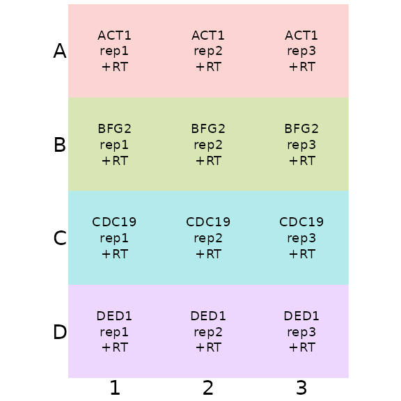
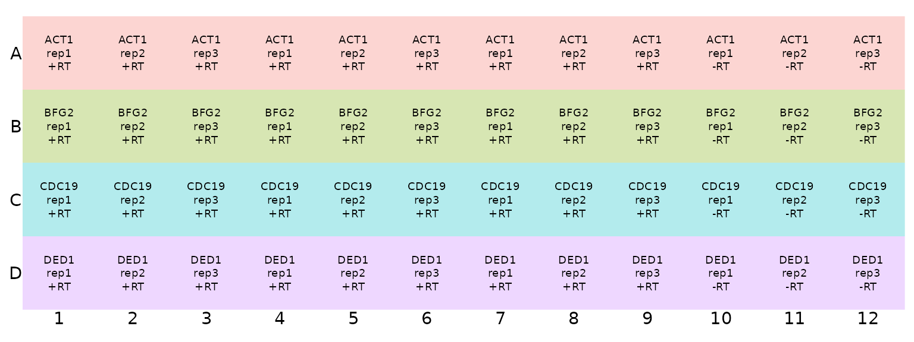
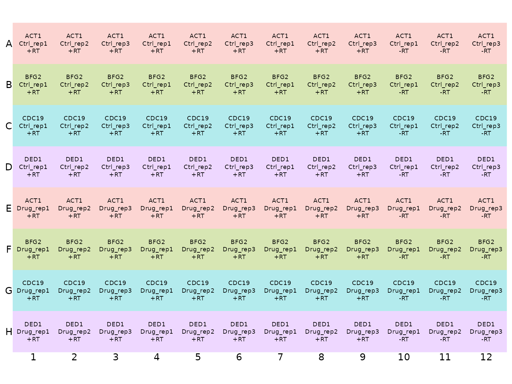

# Introduction to designing an experiment and setting up a plate plan in tidyqpcr

## Overview

This vignette introduces how to set up microwell plates for tidyqpcr
analysis. Start here if you are new-ish to the tidyverse or want to see
explanations about how to design experiments and plate layouts. For
worked examples of tidyqpcr analysis on 96-well and 384-well plates,
see:

- Delta Cq 96-well plate qPCR analysis vignette,
  [`vignette("deltacq_96well_vignette", package = "tidyqpcr")`](https://docs.ropensci.org/tidyqpcr/articles/deltacq_96well_vignette.md)
- Primers and Probes Calibration vignette,
  [`vignette("calibration_vignette", package = "tidyqpcr")`](https://docs.ropensci.org/tidyqpcr/articles/calibration_vignette.md)
- Multifactorial experiment vignette,
  [`vignette("multifactor_vignette", package = "tidyqpcr")`](https://docs.ropensci.org/tidyqpcr/articles/multifactor_vignette.md)

Setting up plates is partly a technical question of how to use functions
in tidyqpcr and the tidyverse, but more fundamentally a question about
how to design your experiment. We recommend the community-led
best-practice [MIQE
guidelines](https://academic.oup.com/clinchem/article/55/4/611/5631762):
how many replicates do you need, and what information do you need to
provide to accompany your analysis?

We suggest thinking through the whole experiment first, including what
you will measure, how many replicates, and what figures you will want to
make. If you plan all the analysis before even starting to grow your
biological samples and extract RNA/DNA, then it is easier to avoid
mistakes. Also, the steps from cell growth, through nucleic acid
extraction and measurement, to finished figures, go much quicker.

This vignette builds from a 12-well “practice plate” up to a 96 well
plate for a plausible small RT-qPCR experiment. The key idea is to
design one replicate of your experiment in a small rectangle on the
plate, then make copies of this small rectangle across the plate for
more replicates or more complicated designs. The goal is that after
working through this vignette, the plate setup in the Multifactorial
vignette will be easier to follow.

This vignette focuses on one primer set per well (for SYBR data), and
doesn’t discuss more than one probe per well (for TaqMan data). Please
create [an issue on tidyqpcr github
repository](https://github.com/ewallace/tidyqpcr/issues) if your data
needs aren’t covered here, and we will try to respond to it.

### Setup knitr options and load packages

This loads the packages necessary for the rest of the code to run.

``` r

# knitr options for report generation
knitr::opts_chunk$set(
  warning = FALSE, message = FALSE, echo = TRUE, cache = FALSE,
  results = "show"
)

# Load packages
library(tidyr)
library(ggplot2)
library(dplyr)
library(tidyqpcr)
```

### Essential information: target_id, sample_id, prep_type

Each well of your plate measures one or more sequence targets in one
DNA/RNA sample. Each sample may be duplicated with different types of
preparation (e.g. no reverse transcriptase enzyme controls). The minimal
information you need to describe your plate is to specify the target(s),
sample, and preparation type for every well.  
So, tidyqpcr expects that your plate plan has at a minimum three pieces
of information per well: target_id, sample_id, and prep_type.

**target_id** should uniquely identify a primer set or primer set/probe
combination that you detect in a well. If you are detecting multiple
regions of the same gene, or trialing multiple probes or primer sets,
you have to give them different target_id names. We chose to name this
variable “target_id” to make it clear that this could refer to a primer
set, or a primer set/ probe combination, detecting a single target
sequence. Note again that the current version of tidyqpcr has been
tested on SYBR/intercalating dye data with one primer set per well only.

**sample_id** should uniquely identify a nucleic acid sample in your
experiment. sample_id can either describe all the relevant information,
for example `HeatShock_10min_RepA`, `InputControl_WildType_Rep3`; or
provide other unique identifying information, for example `S013`.
Functions including `display_plate_qpcr` and
`calculate_deltacq_bysampleid` assume that there is a column called
`sample_id`, and use it to decide which wells get analysed together. We
discuss below how to add other kinds of information/metadata to help
your analysis.

**prep_type** is used for different types of nucleic acid preps from the
same sample. Negative controls are crucial, either no template (NT)
controls, or specifically for RNA-measuring RT-qPCR, the no-reverse
transcriptase control that detects DNA contamination, as discussed in
the MIQE guidelines. So for RT-qPCR experiments we expect to have
prep_types +RT and -RT for each sample, and for primer calibration we
would always have a no template control.

Technical replicates are also necessary for qPCR experiments to track
the variability. This occurs as multiple wells, each of which has the
same combination of target_id, sample_id, and prep_type.

### Using rows and columns to make life easier

Technically, tidyqpcr can cope with any combination of target and sample
in any well. As long as the information is associated clearly, later
analysis will work fine. However, good systematic designs that are
interpretable both by people (you) and by the computer are less error
prone.

One systematic approach is to have each row measure exactly one target
and each column one sample. Or vice versa: one row per sample, one
column per target. This has the advantage of being straightforward to
load with a multichannel pipette.

tidyqpcr is setup to make it easy to specify column contents with a
`colkey`, and row contents with a `rowkey`, then to combine these into a
plan for an entire plate or for a sub-region of a plate.

## A Minimal 48-well plate plan

Let’s imagine we are performing a RT-qPCR experiment measuring:

- Primer sets against 4 genes: ACT1, BFG2, CDC19, and DED1.
- Three biological replicates: rep1, rep2, rep3
- Three technical replicates of +RT and one of -RT

We need 4 \* 3 \* 4 = 48 wells for this experiment. Let’s put this
information into 48 wells of a 96-well plate.

### Practice version, only a single technical replicate.

Here we use the function `tibble` to make the rowkey data tibble, and
the function `rep` to repeat the target_id information enough times to
fill the plate. These functions are imported into tidyqpcr; access their
help files directly by
[`?tibble`](https://tibble.tidyverse.org/reference/tibble.html) and
[`?rep`](https://rdrr.io/r/base/rep.html) from your R session.

We use the built-in constant `LETTERS` to label the well row
(`well_row`) with letters A through D, like they are labeled on a
standard 96-well plate.

``` r

target_id_levels <- c("ACT1", "BFG2", "CDC19", "DED1")

rowkey4 <- tibble(
  well_row = LETTERS[1:4],
  target_id = target_id_levels
)
print(rowkey4)
```

    ## # A tibble: 4 × 2
    ##   well_row target_id
    ##   <chr>    <chr>    
    ## 1 A        ACT1     
    ## 2 B        BFG2     
    ## 3 C        CDC19    
    ## 4 D        DED1

Similarly, we put the sample information in a tibble for the columns,
including `well_col` for the column name

``` r

sample_id_levels <- c("rep1", "rep2", "rep3")
prep_type_levels <- "+RT"

colkey3 <- tibble(
  well_col = 1:3,
  sample_id = sample_id_levels,
  prep_type = prep_type_levels
)
print(colkey3)
```

    ## # A tibble: 3 × 3
    ##   well_col sample_id prep_type
    ##      <int> <chr>     <chr>    
    ## 1        1 rep1      +RT      
    ## 2        2 rep2      +RT      
    ## 3        3 rep3      +RT

To hold the information about a blank plate, with information on both
the row and column for each well, tidyqpcr has the function
`create_blank_plate`:

``` r

create_blank_plate(well_row = LETTERS[1:4], well_col = 1:3)
```

    ## # A tibble: 12 × 3
    ##    well  well_row well_col
    ##    <chr> <fct>    <fct>   
    ##  1 A1    A        1       
    ##  2 A2    A        2       
    ##  3 A3    A        3       
    ##  4 B1    B        1       
    ##  5 B2    B        2       
    ##  6 B3    B        3       
    ##  7 C1    C        1       
    ##  8 C2    C        2       
    ##  9 C3    C        3       
    ## 10 D1    D        1       
    ## 11 D2    D        2       
    ## 12 D3    D        3

Access help for this also at
[`?create_blank_plate`](https://docs.ropensci.org/tidyqpcr/reference/create_blank_plate.md).
Note that there are default functions to make 96-well, 384-well, and
1536-well blank plates, or as above you can customise it.

Now we create our 12-well mini-plate, using the `label_plate_rowcol`
function to combine information from the blank plate template, the
rowkey, and the column key.

``` r

plate_plan12 <- label_plate_rowcol(
  plate = create_blank_plate(well_row = LETTERS[1:4], well_col = 1:3),
  rowkey = rowkey4,
  colkey = colkey3
)

print(plate_plan12)
```

    ## # A tibble: 12 × 6
    ##    well  well_row well_col sample_id prep_type target_id
    ##    <chr> <fct>    <fct>    <chr>     <chr>     <chr>    
    ##  1 A1    A        1        rep1      +RT       ACT1     
    ##  2 A2    A        2        rep2      +RT       ACT1     
    ##  3 A3    A        3        rep3      +RT       ACT1     
    ##  4 B1    B        1        rep1      +RT       BFG2     
    ##  5 B2    B        2        rep2      +RT       BFG2     
    ##  6 B3    B        3        rep3      +RT       BFG2     
    ##  7 C1    C        1        rep1      +RT       CDC19    
    ##  8 C2    C        2        rep2      +RT       CDC19    
    ##  9 C3    C        3        rep3      +RT       CDC19    
    ## 10 D1    D        1        rep1      +RT       DED1     
    ## 11 D2    D        2        rep2      +RT       DED1     
    ## 12 D3    D        3        rep3      +RT       DED1

We visualise this plate plan using the `display_plate_qpcr` function:

``` r

display_plate_qpcr(plate_plan12)
```



Expanding this practice plan to incorporate replicates can be done by
taking this little rectangle and making copies across a larger plate.
This strategy of making copies of a small rectangle makes it easier to
use multichannel pipettes to speed up plate loading. It also means that
technical replicates of the same sample are not in adjacent wells on the
plate, correcting for some location-specific artefacts of amplification
in the qPCR machine. However, if there are row- or column-specific
artefacts, this approach does not allow you detect them separately.

### Replicate columns for the sample_ids and prep_types

Here we are putting three technical replicates of +RT and one of -RT for
each sample. This approach is reliable if DNA contamination from -RT
samples would show up in multiple sample/target combinations.

We could achieve these replicates in the plate plan by explicitly
writing out every time as in `c("+RT", "+RT", "+RT", "-RT")`, or we can
again use the `rep` function. Below, we use `rep("+RT", times = 9)` to
make 9 repeats, meaning that the 3 technical replicates of each of 3 +RT
samples are next to each other. We use the concatenate function `c`, to
arrange that next to the single replicates of the 3 -RT samples.

``` r

sample_id_levels <- c("rep1", "rep2", "rep3")
prep_type_values <- c(rep("+RT", times = 9), rep("-RT", times = 3))
print(prep_type_values)
```

    ##  [1] "+RT" "+RT" "+RT" "+RT" "+RT" "+RT" "+RT" "+RT" "+RT" "-RT" "-RT" "-RT"

``` r

colkey12 <- tibble(
  well_col = 1:12,
  sample_id = rep(sample_id_levels, times = 4),
  prep_type = prep_type_values
)
print(colkey12)
```

    ## # A tibble: 12 × 3
    ##    well_col sample_id prep_type
    ##       <int> <chr>     <chr>    
    ##  1        1 rep1      +RT      
    ##  2        2 rep2      +RT      
    ##  3        3 rep3      +RT      
    ##  4        4 rep1      +RT      
    ##  5        5 rep2      +RT      
    ##  6        6 rep3      +RT      
    ##  7        7 rep1      +RT      
    ##  8        8 rep2      +RT      
    ##  9        9 rep3      +RT      
    ## 10       10 rep1      -RT      
    ## 11       11 rep2      -RT      
    ## 12       12 rep3      -RT

### Putting the 48-well sample together

``` r

plate_plan48 <- label_plate_rowcol(
  plate = create_blank_plate(well_row = LETTERS[1:4], well_col = 1:12),
  rowkey = rowkey4,
  colkey = colkey12
)

print(plate_plan48)
```

    ## # A tibble: 48 × 6
    ##    well  well_row well_col sample_id prep_type target_id
    ##    <chr> <fct>    <fct>    <chr>     <chr>     <chr>    
    ##  1 A1    A        1        rep1      +RT       ACT1     
    ##  2 A2    A        2        rep2      +RT       ACT1     
    ##  3 A3    A        3        rep3      +RT       ACT1     
    ##  4 A4    A        4        rep1      +RT       ACT1     
    ##  5 A5    A        5        rep2      +RT       ACT1     
    ##  6 A6    A        6        rep3      +RT       ACT1     
    ##  7 A7    A        7        rep1      +RT       ACT1     
    ##  8 A8    A        8        rep2      +RT       ACT1     
    ##  9 A9    A        9        rep3      +RT       ACT1     
    ## 10 A10   A        10       rep1      -RT       ACT1     
    ## # ℹ 38 more rows

We again visualise this plate plan using the `display_plate_qpcr`
function

``` r

display_plate_qpcr(plate_plan48)
```



## Adding more samples and repeating targets

What if we want to measure more than one condition, beyond replicates?
For example, a control treatment compared to a drug treatment, or a
change in nutrient conditions? We can achieve this again by extending
the “copied rectangle” approach to include the second condition.

### Adding experimental conditions

In our example, let us do this explicitly. For the rowkey we can use the
`rep` function to measure each target in conditions `Ctrl` and `Drug`,
repeating each 4 times.

``` r

condition_levels <- c("Ctrl", "Drug")
condition_values <- rep(condition_levels, each = 4)
print(condition_values)
```

    ## [1] "Ctrl" "Ctrl" "Ctrl" "Ctrl" "Drug" "Drug" "Drug" "Drug"

### Repeating target names without repeating yourself

We also use the function `rep` to repeat the target_id information 4
times, to fill the plate. Again, ask for help using
[`?rep`](https://rdrr.io/r/base/rep.html).

``` r

target_id_levels <- c("ACT1", "BFG2", "CDC19", "DED1")
target_id_values <- rep(target_id_levels, times = 2)
print(target_id_values)
```

    ## [1] "ACT1"  "BFG2"  "CDC19" "DED1"  "ACT1"  "BFG2"  "CDC19" "DED1"

Now combine this into a rowkey:

``` r

rowkey8 <- tibble(
  well_row = LETTERS[1:8],
  target_id = target_id_values,
  condition = condition_values
)
print(rowkey8)
```

    ## # A tibble: 8 × 3
    ##   well_row target_id condition
    ##   <chr>    <chr>     <chr>    
    ## 1 A        ACT1      Ctrl     
    ## 2 B        BFG2      Ctrl     
    ## 3 C        CDC19     Ctrl     
    ## 4 D        DED1      Ctrl     
    ## 5 E        ACT1      Drug     
    ## 6 F        BFG2      Drug     
    ## 7 G        CDC19     Drug     
    ## 8 H        DED1      Drug

### Recreating the column key

To make this into a plate, we also need a column key. What’s changed is
that, each sample needs to refer both to a condition and to a biological
replicate. If we kept `colkey12` from above, then the variable
`sample_id` would no longer point uniquely to a single sample.

``` r

biol_rep_levels <- c("rep1", "rep2", "rep3")

colkey12_twocondition <- tibble(
  well_col = 1:12,
  biol_rep = rep(biol_rep_levels, times = 4),
  prep_type = prep_type_values
)
print(colkey12_twocondition)
```

    ## # A tibble: 12 × 3
    ##    well_col biol_rep prep_type
    ##       <int> <chr>    <chr>    
    ##  1        1 rep1     +RT      
    ##  2        2 rep2     +RT      
    ##  3        3 rep3     +RT      
    ##  4        4 rep1     +RT      
    ##  5        5 rep2     +RT      
    ##  6        6 rep3     +RT      
    ##  7        7 rep1     +RT      
    ##  8        8 rep2     +RT      
    ##  9        9 rep3     +RT      
    ## 10       10 rep1     -RT      
    ## 11       11 rep2     -RT      
    ## 12       12 rep3     -RT

### Combining information into a larger plate plan

Now we put this together into a plan for the whole 96-well plate:

``` r

plate_plan96_take1 <- label_plate_rowcol(
  plate = create_blank_plate(well_row = LETTERS[1:8], well_col = 1:12),
  rowkey = rowkey8,
  colkey = colkey12_twocondition
)

print(plate_plan96_take1)
```

    ## # A tibble: 96 × 7
    ##    well  well_row well_col biol_rep prep_type target_id condition
    ##    <chr> <fct>    <fct>    <chr>    <chr>     <chr>     <chr>    
    ##  1 A1    A        1        rep1     +RT       ACT1      Ctrl     
    ##  2 A2    A        2        rep2     +RT       ACT1      Ctrl     
    ##  3 A3    A        3        rep3     +RT       ACT1      Ctrl     
    ##  4 A4    A        4        rep1     +RT       ACT1      Ctrl     
    ##  5 A5    A        5        rep2     +RT       ACT1      Ctrl     
    ##  6 A6    A        6        rep3     +RT       ACT1      Ctrl     
    ##  7 A7    A        7        rep1     +RT       ACT1      Ctrl     
    ##  8 A8    A        8        rep2     +RT       ACT1      Ctrl     
    ##  9 A9    A        9        rep3     +RT       ACT1      Ctrl     
    ## 10 A10   A        10       rep1     -RT       ACT1      Ctrl     
    ## # ℹ 86 more rows

Here we had to change the `create_blank_plate` call to include all 8
rows.

### Making sure sample names are present and unique

This plate plan lacks a `sample_id` column, however. In fact in this
example some of the sample_id information is in the rowkey (the
condition) and some comes from the column key (the biological
replicate). To unite this information, we will conveniently use the
`unite` function from the tidyr package:

``` r

plate_plan96 <- label_plate_rowcol(
  plate = create_blank_plate(well_row = LETTERS[1:8], well_col = 1:12),
  rowkey = rowkey8,
  colkey = colkey12_twocondition
) %>%
  unite(sample_id, condition, biol_rep, remove = FALSE)

print(plate_plan96)
```

    ## # A tibble: 96 × 8
    ##    well  well_row well_col sample_id biol_rep prep_type target_id condition
    ##    <chr> <fct>    <fct>    <chr>     <chr>    <chr>     <chr>     <chr>    
    ##  1 A1    A        1        Ctrl_rep1 rep1     +RT       ACT1      Ctrl     
    ##  2 A2    A        2        Ctrl_rep2 rep2     +RT       ACT1      Ctrl     
    ##  3 A3    A        3        Ctrl_rep3 rep3     +RT       ACT1      Ctrl     
    ##  4 A4    A        4        Ctrl_rep1 rep1     +RT       ACT1      Ctrl     
    ##  5 A5    A        5        Ctrl_rep2 rep2     +RT       ACT1      Ctrl     
    ##  6 A6    A        6        Ctrl_rep3 rep3     +RT       ACT1      Ctrl     
    ##  7 A7    A        7        Ctrl_rep1 rep1     +RT       ACT1      Ctrl     
    ##  8 A8    A        8        Ctrl_rep2 rep2     +RT       ACT1      Ctrl     
    ##  9 A9    A        9        Ctrl_rep3 rep3     +RT       ACT1      Ctrl     
    ## 10 A10   A        10       Ctrl_rep1 rep1     -RT       ACT1      Ctrl     
    ## # ℹ 86 more rows

Again, check the help file with
[`?unite`](https://tidyr.tidyverse.org/reference/unite.html). The line
`unite(sample_id, condition, biol_rep, remove = FALSE)` means that we
create a new variable `sample_id` from existing variables `condition`
and `biol_rep`, and `remove = FALSE` means that we keep the original
variables in the table as well. The syntax `%>%` from the magrittr
package is a way to chain functions together.

Now we display the plate to check that we have everything in place:

``` r

display_plate_qpcr(plate_plan96)
```



We could print this plate map and take it into the lab as a visual aid
for plate loading.

## Creating plate layouts with standard designs

Some tidyqpcr functions provide shortcuts to create plate layouts with
standard designs:

- create_colkey_6_in_24()
- create_colkey_4diln_2ctrl_in_24()
- create_colkey_6diln_2ctrl_in_24()
- create_rowkey_4_in_16()
- create_rowkey_8_in_16_plain()

These focus on setting up column keys and row keys for 384-well plates
where samples are repeated in blocks of 4, 6 or 8. Some are specialised
for primer calibration, including serial dilution and control samples.
These functions can be adapted for your own needs. For example, the
default levels of `prep_type` are relevant for RT-qPCR, and you would
want to change those for plain qPCR or ChIP-qPCR. Please consult the
function documentation for details of the parameters and outputs,
e.g. [`?create_colkey_6_in_24`](https://docs.ropensci.org/tidyqpcr/reference/create_colkey_6_in_24.md).

For examples of standard layouts in use, see the vignettes:

- Primers and Probes Calibration vignette,
  [`vignette("calibration_vignette", package = "tidyqpcr")`](https://docs.ropensci.org/tidyqpcr/articles/calibration_vignette.md)
- Multifactorial experiment vignette,
  [`vignette("multifactor_vignette", package = "tidyqpcr")`](https://docs.ropensci.org/tidyqpcr/articles/multifactor_vignette.md)

## What information goes in the plate plan, revisited?

The plate plan should contain:

- All the information you need to identify the sample and
  target/probe/primer set *uniquely*.
- Everything you might want to plot and compare with outputs.

For example, suppose you are testing multiple primer sets against the
same target, your favourite gene `YFG1`, and you have primer sets A, B,
and C. Then you might want a variable called `Gene` with value `YFG1`
for all of these, in addition to the variable `target_id` with levels
`YFG1_A`, `YFG1_B`, and `YFG1_C`.

This package, tidyqpcr, builds on the flexible approaches available from
the tidyverse family of packages. We presented above an example of
specifying individual parts of information about a sample, then uniting
them with the tidyr function `unite`. There’s also an inverse to that,
`separate`: for example if you have samples from three strains grown in
two temperatures in timepoints in multiple biological replicates, you
might specify sample_id as `WT_25C_10min_rep1`, and then use
`separate(col = sample_id, into = c("strain", "temperature", "time_min", "biol_rep"), remove = FALSE)`
to create individual columns with copies of that information. The key is
to be consistent and to make the descriptions both human-readable and
also computer-readable: human-readable for your sanity,
computer-readable so that your analysis runs automatically and
correctly.

The functions `unite` and `separate` have visual descriptions on the
[RStudio data wrangling cheat
sheat](https://www.rstudio.com/wp-content/uploads/2015/02/data-wrangling-cheatsheet.pdf).
Another useful tidyr function is `crossing`, which creates a table with
all combinations of the variables that you supply, say if you want to
measure all strains in all conditions.

## Hints and Tips on Plate setup

- In tidyqpcr we chose to give all variables snake_case names, such as
  `sample_id`, `prep_type`, following the [tidyverse style
  guide](https://style.tidyverse.org).
- What if you are loading a 384-well plate with a fixed-spacing
  multichannel pipette that loads every second row? If you want to set
  up the plate plan to load the same sample_id/target_id in two adjacent
  rows, using `rep(sample_id, each = 2)` might help.
- If your experiment spans multiple plates, it can be helpful to re-use
  `colkey` and `rowkey` in defining similar plate plans. You could
  re-use the entire plate plan if the plates are exact replicates, as
  long as you ensure the `sample_id` name includes replicate information
  and so is unique for the analysis.
- If you want to avoid certain rows or columns, change the `well_row` or
  `well_col` arguments in your blank plates, row keys, and column keys.
  For example
  `create_blank_plate(well_row = LETTERS[2:7], well_col = 2:11)` creates
  a blank 96-well plate with outside rows and columns empty.
- If you want your data to display in a preferred order, make it a
  factor. “Factor” is the name in R for data that has a fixed and known
  set of possible values. R calls these possible values, “levels”. A
  list of pets might have levels: “cat”, “dog”, and “hamster”. Then your
  pets might have the values `c("cat", "cat", "cat", "dog")`. The same
  goes for target genes, sample ids, and growth conditions. In this
  vignette we have tried to distinguish between “levels” and “values” in
  our code examples. To learn more about factors, see the [chapter on
  factors in R For Data Science (Wickham &
  Grolemund)](https://r4ds.had.co.nz/factors.html)
